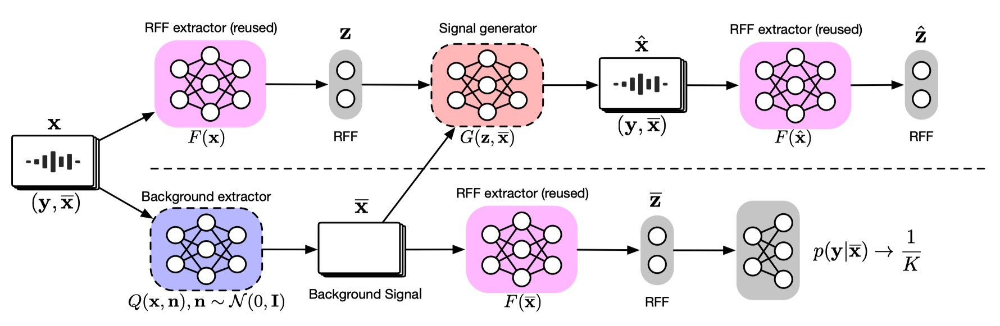
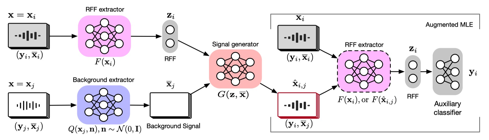

# DR-RFF
[Disentangled Representation Learning for RF Fingerprint Extraction under Unknown Channel Statistics](https://ieeexplore.ieee.org/document/10105269) 

**Abstract**—Deep learning (DL) applied to a device’s radiofrequency fingerprint (RFF) has attracted significant attention in physical-layer authentication due to its extraordinary classification performance. Conventional DL-RFF techniques are trained by adopting maximum likelihood estimation (MLE). Although their discriminability has recently been extended to unknown devices in open-set scenarios, they still tend to overfit the channel statistics embedded in the training dataset. This restricts their practical applications as it is challenging to collect sufficient training data capturing the characteristics of all possible wireless channel environments. To address this challenge, we propose a DL framework of disentangled representation (DR) learning that first learns to factor the signals into a device-relevant component and a device-irrelevant component via adversarial learning. Then, it shuffles these two parts within a dataset for implicit data augmentation, which imposes a strong regularization on RFF extractor learning to avoid the possible overfitting of deviceirrelevant channel statistics, without collecting additional data from unknown channels. Experiments validate that the proposed approach, referred to as DR-based RFF, outperforms conventional methods in terms of generalizability to unknown devices under unknown complicated propagation environments, e.g., dispersive multipath fading channels, even though all the training data are collected in a simple environment with dominated direct line-of-sight (LoS) propagation paths.


## Training algorithm schematic of DR-RFF

### QG-step


### F-step


## How to run?
### 1 Download datasets and checkpoints
In addition to the dataset, we also provide some pre-trained models available at [Baidu Cloud](https://pan.baidu.com/s/1nQ6wa9ak8hJNdUPtyFKvNA?pwd=uxh9). Place the downloaded dataset in Folder **datasets/processed** and model files in Folder **chkpts**, though the latter is optional.

Chkpts prefixed with 'best' represent top-performing models on the validation set during training, while others reflect the final models. The 'is_best' flag in trainer.run() of **trainer_DR_RFF.py** dictates whether to load the 'best' model.


### 2 Run DR-RFF
Uncomment the lines in trainer_DR_RFF.py to run the corresponding model, e.g.,
```python
if __name__ == '__main__':

    ## DR-RFF
    trainer = Trainer(train_snr=None,
                    device=0, d2=18, z_dim=512, 
                    lamda=0.5, alpha=10, beta=10, epsilon=0.0, is_NS=False, is_HP=True, is_FIR=False)

    ## ML-RFF
    # trainer = Trainer(train_snr=None,
    #                 device=0, d2=18, z_dim=512, 
    #                 lamda=0.0, alpha=10, beta=10, epsilon=0.0, is_NS=False, is_HP=True, is_FIR=False)

    ## AWGN
    # trainer = Trainer(train_snr=30,
    #                 device=0, d2=18, z_dim=512, 
    #                 lamda=0.0, alpha=10, beta=10, epsilon=0.0, is_NS=False, is_HP=True, is_FIR=False)
    
    trainer.run(load_best=True, retrain=False, is_del_loger=False)
```
then
```cmd
cd yourpath/DR-RFF
python trainer_DR_RFF.py
```

## Previous work
[NS-RFF](https://github.com/xrj-com/NS-RFF)

## Requirments
[marveltoolbox](https://github.com/xrj-com/marveltoolbox)


## Citation
```
@ARTICLE{xie2023disentangled,
  author={Xie, Renjie and Xu, Wei and Yu, Jiabao and Hu, Aiqun and Ng, Derrick Wing Kwan and Lee Swindlehurst, A.},
  journal={IEEE Transactions on Communications}, 
  title={Disentangled representation learning for RF fingerprint extraction under unknown channel statistics}, 
  year={2023, Early Access},
  volume={},
  number={},
  month = apr,
  pages={1-1},
  doi={10.1109/TCOMM.2023.3268286}}
```